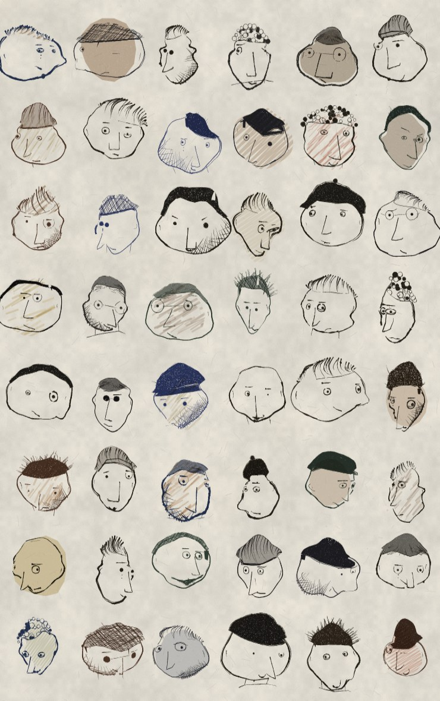

# a dude

[Open the page](https://johnbr0phy.github.io/faces/). One click, another dude.

[](https://johnbr0phy.github.io/faces/?plate=1&s=2026)

Every feature is a function. Nothing is a bitmap. Faces are pinned to a rough
3D skull, so yaw, pitch and roll carry the eyes, nose, mouth, hair and hats
around with the head instead of sliding them across a flat oval. The outline
is the silhouette of that skull — the radial extent of the projected form plus
a per-seed lump profile that can dent inward — so heads come out as potatoes
rather than eggs.

The ink is a dry nib: a stroke is a filled variable-width ribbon with a wet
core and loose filaments down each flank, pressure running one to five swells
along its length, pooling where it lands and lifting on the way out. Masses are
built from strokes so their ends make the edge. The paper has tooth and mottle,
tuned by measurement.

Which pen is a property of the drawing. Most days it is the house dry nib, but
sometimes it is a biro — thin, navy, near-constant width, skipping where the
ball runs dry and never pooling — or a fineliner laying one dead-even line, or
a wet blue-black fountain nib that blots into every join, or something soft and
broad and grainy. Colour, weight, pressure wave, skip rate, pooling, filaments
and paper bite all come off the pen, so every mark on the page agrees, down to
the hair and the name written underneath.

## Run it

Open `index.html`, or:

```
python3 -m http.server 8765
```

then visit `http://localhost:8765`.

Space, click, or tap for another. The seed is in the URL (`?s=4929`), so every
dude is reproducible.

He starts moving. `animate` (or `m`) cycles the twenty-five things he can do;
`a` lets him rest. The words are written on the paper, so a phone can press
them. `?anim=0` loads him still. `?m=walk` (or wave, jump, look, dance, shrug,
smile, cry, nod, point, clap, scratch, crouch, kick, stretch, bow, think, hail,
stagger, hop, peek, sneak, yawn, cheer, fidget) insists on one; without `?m`
his seed picks.

He is not a picture being tweened. The head is already a skull with a yaw, a
pitch and a roll, and the body is already a stick rig the silhouette is grown
around; animating him is a matter of moving that rig and inking him again.
Twelve drawings a second, each one drawn from scratch, so the line boils the
way a line does when a hand draws it twice and the head turns in space rather
than skewing on the page. The sheet — paper, grain, name, the words at the
foot of the page — is laid down once and reused, because none of it moves and
the grain pass alone costs three times what the whole figure does.

`?plate=1` renders a sheet of 48 heads on one page.

| | |
| --- | --- |
| `?s=4929` | that dude, every time |
| `?anim=0` | still |
| `?m=walk` | walk, wave, jump, look, dance, shrug, or any of the others |
| `?plate=1` | a sheet of 48 heads |

`scripts/shot.sh` screenshots seeded dudes; `scripts/plate.sh` does the same for
a sheet; `scripts/anim.sh <seed> <motion>` grabs the frames of one cycle and
`scripts/strip.py` lays them out as a strip to flip through.

The drawings are after [mannay](https://x.com/mannay/status/2087522034351796728).

## What's next

Walking around him. The skull already turns; this is just more yaw — around
once, back of the potato, face gone, hair still there. It is not on the page.
There is a preview at [v2](https://johnbr0phy.github.io/faces/v2.html). The
slider is a slider, which is why it is not the page. Arrow keys work there
too. `?yaw=90` insists.

An aisle of them — the weekly shop, several dudes standing in a place — is
also on the bench. Same paper, same pen, not ready.
